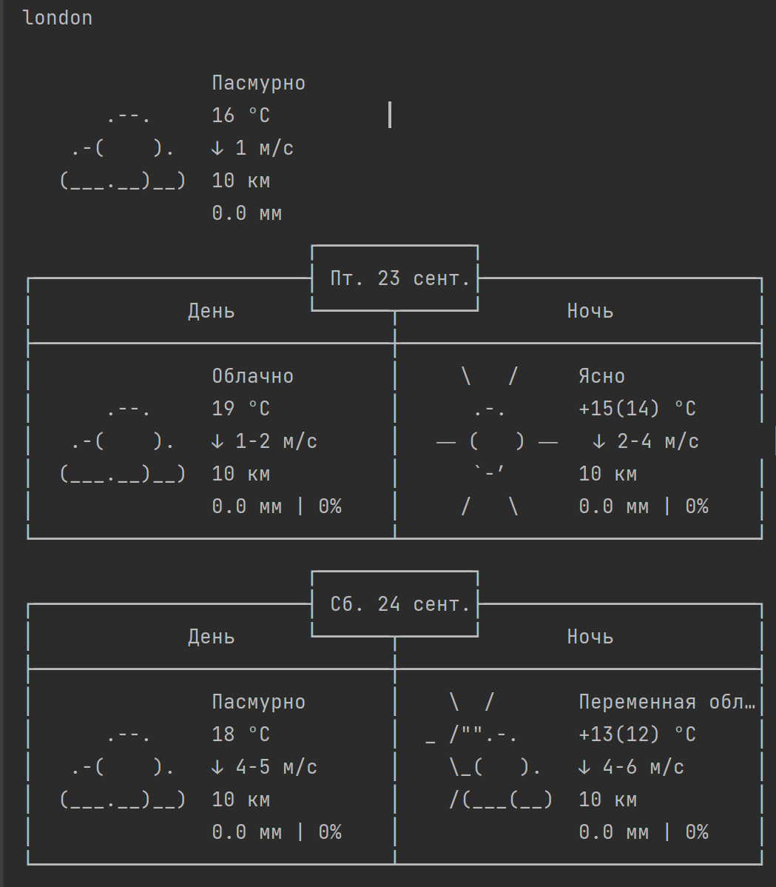

# Погода в разных городах.
Скрипт предназначен для мониторинга погоды в Лондоне, Шереметьево и Череповце. Очень простой и удобный способ.

### Требования к окружению
Устанавливается на любую версию Python.

### Необходимые библиотеки
Для корректной работы скрипта необходимо установить зависимости
> pip install -r requirements.txt

### Запуск скрипта производится следующей командой
> python main.py
### Результат работы скрипта выводится в терминал

     